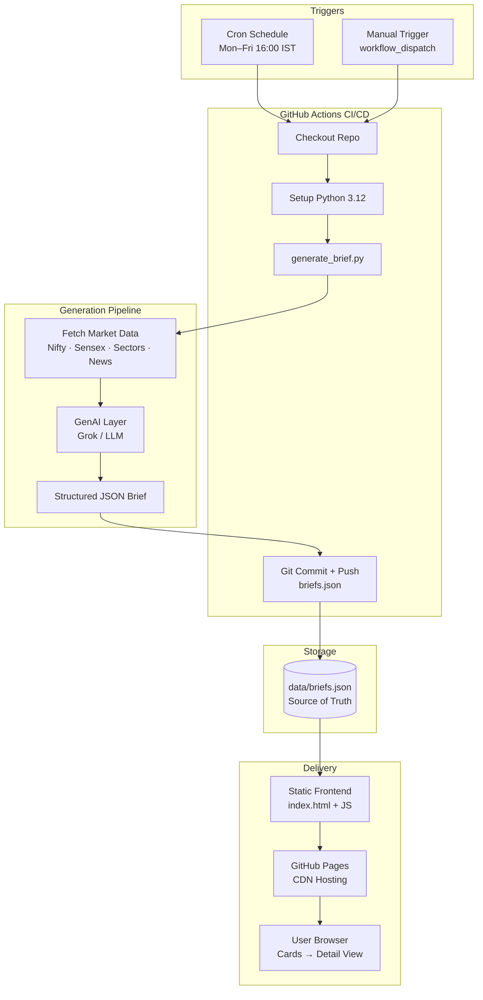

# Daily Fin Brief

**Automated Indian Stock Market Daily Briefs**  
GenAI + GitHub Actions + Static Site · Perfect DevOps / Cloud / SRE portfolio project

Live site (after you push + enable Pages): `https://<your-username>.github.io/daily-fin-brief`

---

## Architecture (Full Automation)



### High-level flow (what happens every day)

1. **Trigger** — GitHub Actions runs on schedule (after market close) or manually
2. **Generate** — Python script fetches market data + calls GenAI to produce a structured brief
3. **Commit** — Updated `data/briefs.json` is committed back to the repo (GitOps style)
4. **Publish** — GitHub Pages automatically serves the latest static site
5. **Consume** — User opens the site → sees newest card on top → clicks for full detail

---

## What We Built & Why We Chose This Design

| Layer | Choice | Why this choice |
|-------|--------|-----------------|
| **Hosting** | GitHub Pages | Free, zero-ops, automatic deploy on push, perfect for static sites, good for resume |
| **CI/CD** | GitHub Actions | Native to GitHub, free for public repos, cron + manual trigger, secrets support, industry standard |
| **Data store** | `briefs.json` in repo | Simple, version-controlled, no database needed, easy to inspect/diff, GitOps friendly |
| **Frontend** | Pure HTML + Tailwind CDN + vanilla JS | No build step, loads fast, works offline (embedded fallback), easy to maintain |
| **Generation** | Python script + GenAI | Easy to call APIs, structured JSON output, can later add real market data sources |
| **UI Pattern** | Card list → Detail view | Matches your request: newest first, compact preview, rich detail on click |
| **Automation style** | Commit-back pattern | The pipeline updates its own data file → site updates automatically. Classic GitOps |

### Why this is strong for a DevOps / Cloud / SRE resume

- Real **scheduled CI/CD** (not just “hello world” Actions)
- **GenAI integration** in a production-like pipeline
- **Idempotent** daily job (safe to re-run)
- **Secrets** handling for API keys
- **Static site** + data-driven UI (modern frontend pattern)
- Everything is **code** — no manual dashboard clicking
- Easy to extend later (Slack notification, X auto-post, real NSE API, etc.)

---

## Project Structure

```
daily-fin-brief/
├── index.html                     # Frontend (cards + rich detail view)
├── data/
│   └── briefs.json                # All briefs (newest first) — source of truth
├── scripts/
│   └── generate_brief.py          # Core automation (data + GenAI)
├── .github/
│   └── workflows/
│       └── daily-brief.yml        # Scheduled CI/CD pipeline
└── README.md
```

---

## How the frontend works

- Homepage shows **one card per day**, **newest date always at the top**
- Each card shows: Date + OPEN/CLOSED + Nifty change + Top performer + short headline
- Click any card → full brief opens (Market Overview, Drivers, Global Cues, FII/DII, Sectors, Stocks, Outlook)
- Works both on GitHub Pages **and** when opened as a local file (embedded fallback)

---

## Getting started

1. Create a new public GitHub repo (e.g. `daily-fin-brief`)
2. Push this folder
3. Enable **GitHub Pages** (Settings → Pages → Deploy from `main` / root)
4. (Recommended) Add secrets:
   - `XAI_API_KEY` or `OPENAI_API_KEY`
5. Workflow runs Mon–Fri after market close, or trigger it manually from the Actions tab

### Local testing

```bash
cd daily-fin-brief
python -m http.server 8000
# Open http://localhost:8000
```

---

## Resume bullet (ready to use)

> Designed and built an end-to-end automated daily market brief system using **GitHub Actions**, **GenAI (LLM)**, and a static frontend. The pipeline fetches market data, generates structured analysis via LLM, commits updates (GitOps), and serves newest-first cards on GitHub Pages. Demonstrates CI/CD, AI integration, and data-driven UI.

---

## Next enhancements (good interview talking points)

- Replace mock data with real sources (yfinance / NSE / Moneycontrol)
- Stronger prompt engineering + JSON schema validation
- Auto-post summary to X
- Slack / Discord notification when a new brief is published
- Simple archive filter by month
- Move Tailwind to a proper build (optional)

---

**Author:** Suyog Jagtap ([@suyog_j_](https://x.com/suyog_j_))  
Cloud / SRE · Building practical automation projects

---

## GenAI Setup (xAI Grok + Claude)

The pipeline supports **both** providers. Preference order:

1. `XAI_API_KEY` present → uses **xAI Grok**
2. Only `ANTHROPIC_API_KEY` present → uses **Claude**
3. Set `LLM_PROVIDER=xai` or `claude` to force one

### Add secrets in GitHub

Repo → **Settings** → **Secrets and variables** → **Actions** → **New repository secret**

| Secret name | Value |
|-------------|--------|
| `XAI_API_KEY` | your xAI API key |
| `ANTHROPIC_API_KEY` | your Claude API key (optional fallback) |
| `LLM_PROVIDER` | `xai` or `claude` (optional) |

### Test locally

```bash
export XAI_API_KEY="your-key-here"
# or
export ANTHROPIC_API_KEY="your-key-here"

cd daily-fin-brief
FORCE=1 python scripts/generate_brief.py
```

Then open the site — the new brief will appear at the top.
